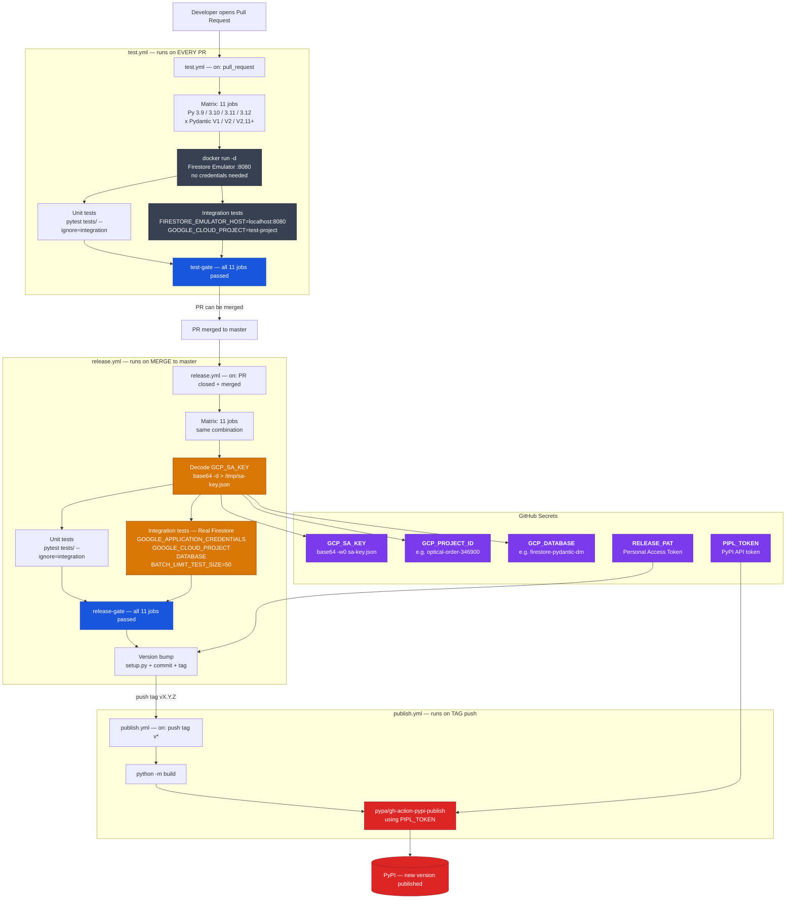

# Integration Tests

This directory contains the full integration test suite for `firestore-pydantic-odm`.
Unlike the unit tests in `tests/` (which use `MagicMock`), these tests run against a
**real Firestore backend** and validate that data actually persists, queries return
correct results, and the ODM behaves identically to the raw Firestore SDK.

---

## Test Files

| File | Tests | What it covers |
|------|------:|----------------|
| `test_crud_emulator.py` | 15 | Create, read, update, delete, exists — top-level documents |
| `test_queries_emulator.py` | 22 | Filters (`==`, `!=`, `>`, `in`, `array_contains`), ordering, limit, offset, count |
| `test_subcollections_emulator.py` | 18 | Subcollection hierarchy, cascade delete, accessor pattern, collection group |
| `test_batch_emulator.py` | 7 | Batch create / update / delete, mixed operations, auto-ID, 500-op limit |
| `test_sdk_validation.py` | 9 | Cross-validation: every operation verified via both ODM and raw SDK |
| **Total** | **71** | |

---

## Backend Detection

The `conftest.py` auto-detects which backend to use based on environment variables:

| Variable | Emulator mode | Real Firestore mode |
|----------|:-------------:|:-------------------:|
| `FIRESTORE_EMULATOR_HOST` | `localhost:8080` | *(unset or empty)* |
| `GOOGLE_CLOUD_PROJECT` | `test-project` | your GCP project ID |
| `GOOGLE_APPLICATION_CREDENTIALS` | *(not needed)* | path to SA JSON key |
| `DATABASE` | *(not needed)* | named Firestore database |
| `BATCH_LIMIT_TEST_SIZE` | `500` (default) | `50` (saves free-tier quota) |

---

## Running Locally

### Against the Emulator

```bash
# Start the emulator
docker compose -f docker-compose.test.yml up -d

# Run only integration tests
FIRESTORE_EMULATOR_HOST=localhost:8080 pytest tests/integration/ -v

# Run the full suite (unit + integration)
FIRESTORE_EMULATOR_HOST=localhost:8080 pytest tests/ -v

# Stop the emulator
docker compose -f docker-compose.test.yml down
```

### Against Real Firestore

```bash
GOOGLE_APPLICATION_CREDENTIALS=./sa.json \
GOOGLE_CLOUD_PROJECT=real-project \
DATABASE=databasename \
BATCH_LIMIT_TEST_SIZE=50 \
pytest tests/integration/ -v --tb=short
```

---

## CI / CD Workflow



---

## GitHub Secrets Reference

| Secret | How to generate | Used in |
|--------|-----------------|---------|
| `GCP_SA_KEY` | `base64 -w0 sa-key.json` | `release.yml` — authenticates to real Firestore |
| `GCP_PROJECT_ID` | Your GCP project ID string | `release.yml` |
| `GCP_DATABASE` | Named Firestore database (omit for default) | `release.yml` |
| `RELEASE_PAT` | GitHub PAT with `repo` scope | `release.yml` — pushes version bump commit |
| `PIPL_TOKEN` | PyPI API token | `publish.yml` — publishes to PyPI |

---

## Dual-Layer Validation

Every integration test validates operations **twice**: once through the ODM, once through
the raw `AsyncClient`. This ensures the ODM is not hiding data corruption or silent failures.

```
Phase 1 — Write via ODM    ->  user = User(name="Alice"); await user.save()
Phase 2 — Verify via SDK   ->  doc = await client.collection("users").document(id).get()
                               assert doc.to_dict()["name"] == "Alice"

Phase 3 — Write via SDK    ->  await client.collection("users").document("x").set({...})
Phase 4 — Read via ODM     ->  result = await User.get("x")
                               assert result.name == ...
```

---

## Data Cleanup

| Backend | Method | Speed |
|---------|--------|-------|
| Emulator | `DELETE http://{host}/emulator/v1/projects/{project}/databases/(default)/documents` | ~5 ms |
| Real Firestore | Recursive batch delete on known test collections (`users`, `products`) | ~200 ms |

Cleanup runs **after each test** via the `clean_firestore` autouse fixture, guaranteeing full isolation.
